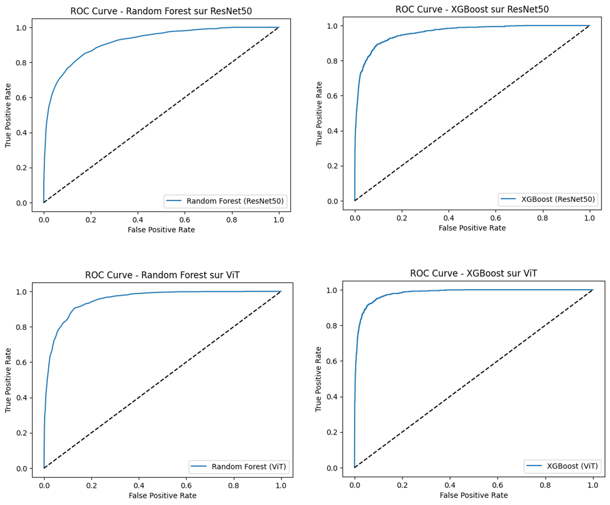
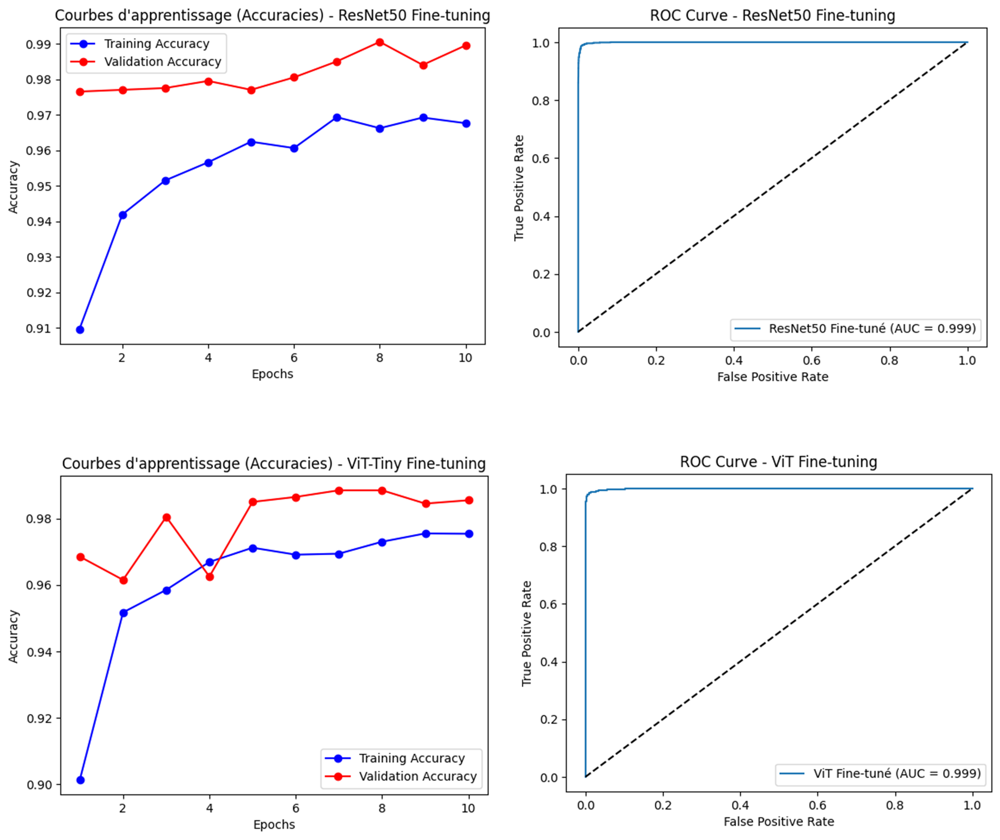

# Satellite Damage Classification

**Satellite Damage Classification by Transfer Learning**

This repository contains code and experiments for classifying damages on satellite images using transfer learning. The project was inspired by the work of [Cao and Choe, 2020] and compares two main approaches:
- **Approach A:** Feature extraction using pre-trained models (ResNet50 and ViT) followed by classical classifiers (RandomForest and XGBoost).
- **Approach B:** Fine-tuning pre-trained deep learning models on our specific dataset. Due to hardware constraints (a GPU with only 2 GB of memory), we fine-tuned ResNet50 and ViT-Tiny (a lighter version of ViT).

## Table of Contents

- [Project Overview](#project-overview)
- [Installation](#installation)
- [Usage](#usage)
- [Experimental Results](#experimental-results)
- [Discussion and Future Work](#discussion-and-future-work)
- [References](#references)

## Project Overview

This project aims to automate the evaluation of building damages on satellite images following natural disasters. The key objectives are:
- To reduce the time and cost associated with manual image inspection.
- To develop an automated solution that quickly and accurately classifies satellite images into two categories: **"damage"** and **"no damage"**.

The dataset is based on [Cao and Choe, 2020] and comprises:
- **train_another** : the training data; 5000 images of each class
- **validation_another** : the validation data; 1000 images of each class
- **test_another** : the unbalanced test data; 8000/1000 images of damaged/undamaged classes

The project explores two transfer learning strategies:
1. **Feature Extraction (Approach A):** Pre-trained models (ResNet50 and ViT) are used to extract image features. These features are then used to train traditional classifiers such as RandomForest and XGBoost.
2. **Fine-Tuning (Approach B):** The entire pre-trained model is adapted to the binary classification task. In our experiments, ResNet50 and ViT-Tiny (chosen over full ViT due to GPU memory limitations) were fine-tuned over 10 epochs.


## Installation

To install the required dependencies, simply run:

```bash
pip install -r requirements.txt
```

## Usage

You can run the code using the provided Jupyter notebook `damage_classification.ipynb` 


## Experimental Results

The experimental evaluation compared the following models:

| **Model**                                         | **Validation Accuracy** | **Test Accuracy (Unbalanced)** | **Test AUC (Unbalanced)** |
|---------------------------------------------------|-------------------------|-------------------------------|---------------------------|
| CNN + DA + DO (Adam) [Cao and Choe, 2020]           | 98.06%                  | 97.08%                        | 99.6%                     |
| Leaky + Transfer VGG-16 + DA + FDO + L2 (Adam) [Cao and Choe, 2020] | 97.5%                   | 96.21%                        | –                         |
| ResNet50 + RF (Approach A)                          | 79.9%                   | 70.9%                         | 91.8%                     |
| ResNet50 + XGBoost (Approach A)                     | 87.5%                   | 84.3%                         | 95.9%                     |
| ViT + RF (Approach A)                             | 85.3%                   | 79.5%                         | 95.3%                     |
| ViT + XGBoost (Approach A)                        | 93.1%                   | 90.0%                         | 98.1%                     |
| **Fine-tuned ResNet50 (Approach B)**                | **98.95%**              | **98.3%**                     | **99.9%**                 |
| **Fine-tuned ViT‑Tiny (Approach B)**                | **98.55%**              | **98.1%**                     | **99.9%**                 |

*Note: The first two models are referenced from [Cao and Choe, 2020].*

**Figures:**



- *(Figure for Approach A)*: ROC curves (4 subplots: ResNet50+RF, ResNet50+XGBoost, ViT+RF, ViT+XGBoost)


- *(Figure for Approach B)*: ROC curves and learning curves (4 subplots: two ROC curves for fine-tuned ResNet50 and fine-tuned ViT‑Tiny, and two learning curves showing training/validation accuracy)

## Discussion and Future Work

Our experiments show that the fine-tuning approach (Approach B) achieves superior performance (test accuracies and AUCs above 98%) despite using only 10 epochs—significantly outperforming the benchmarks from [Cao and Choe, 2020], which required 100 epochs on more powerful hardware.  
Key observations:
- **Feature Extraction vs. Fine-Tuning:** Traditional classifiers trained on extracted features yield lower performance (accuracy ranging from ~70% to ~90%) compared to fine-tuning the entire model.
- **Model Choice:** Fine-tuning ResNet50 slightly outperforms fine-tuning ViT‑Tiny; however, due to GPU memory limitations (2 GB), ViT‑Tiny is a more viable option.
- **Training Protocol:** The use of adaptive optimizers (Adam), dropout, and L2 regularization has proven effective in preventing overfitting and ensuring rapid convergence.
- **Resource Constraints:** Even with limited hardware, our approach achieved competitive performance, which suggests that further optimizations (e.g., using a higher-capacity GPU or optimizing data preprocessing) could enhance training speed and overall results.

Future work will focus on optimizing hyperparameters, exploring other lightweight architectures, and extending the methodology to multi-class scenarios or different types of damage.

## References

- [Cao and Choe, 2020] Cao, Q.D. & Choe, Y. (2020). *Building Damage Annotation on Post-Hurricane Satellite Imagery Based on Convolutional Neural Networks*. Available at arXiv:1807.01688v4.pdf.
- [Liang et al., 2016] Liang, Y., Monteiro, S.T. & Saber, E.S. (2016). *Transfer Learning for High Resolution Aerial Image Classification*. Available at RIT Digital Institutional Repository.
- [Zou and Zhong, 2018] Zou, M. & Zhong, Y. (2018). *Transfer Learning for Classification of Optical Satellite Image*. Available at Springer.

